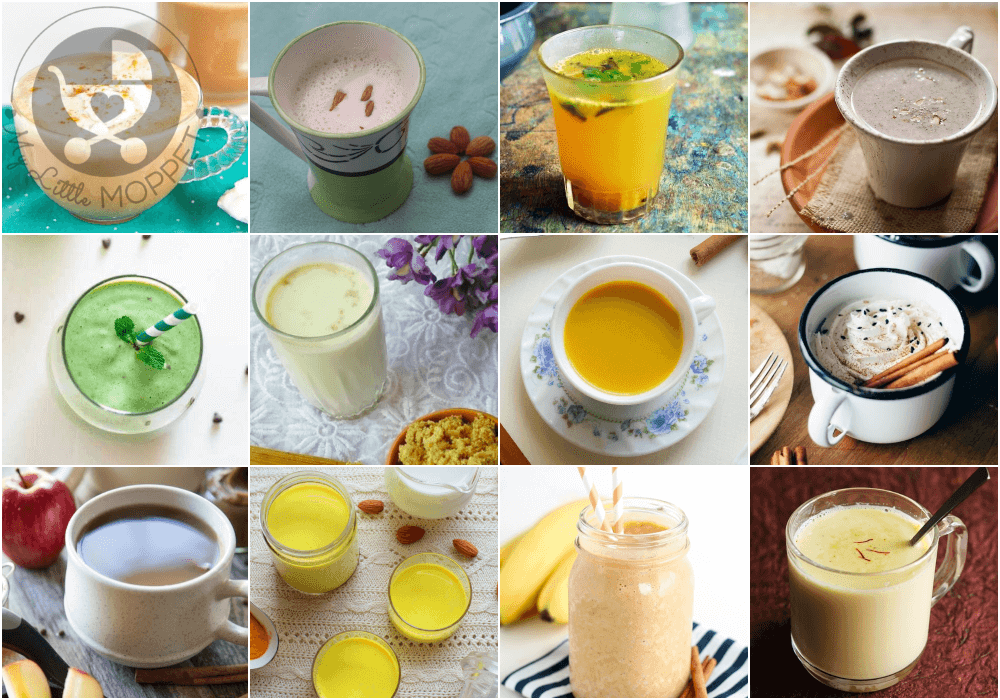
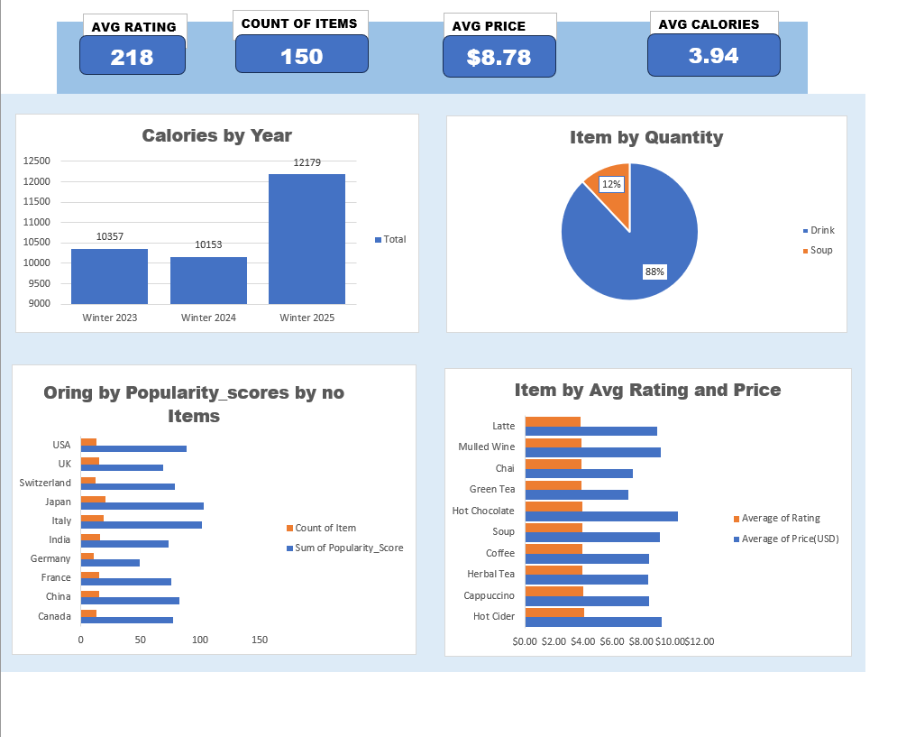

# 🥤 Beverages Sales Data Analysis

## 📊 Project Overview

This project analyzes a beverage sales dataset to understand revenue trends, product performance, and profitability.

The dataset was cleaned and analyzed using Microsoft Excel. Pivot tables and dashboards were created to generate insights and support business decision-making.

This project demonstrates my workflow:
Data Cleaning → Analysis → Dashboard → Insights → Reporting

---

## 🛠 Tools Used
- Microsoft Excel
- Pivot Tables
- Data Cleaning
- Dashboard Creation
- Data Visualization

---

## 📁 Dataset Description
The dataset includes:
- Product name
- Category
- Sales revenue
- Quantity sold
- Profit
- Sales channel
- Date

---

## 📈 Dashboard Preview

---

## 🔎 Key Insights
- A few top beverage categories generate most revenue
- High-volume drinks drive total sales
- Premium drinks generate higher profit margins
- Sales show mild seasonal trends
- Certain channels dominate revenue

---

## 💡 Business Recommendations
- Focus marketing on top-selling drinks
- Promote high-margin products
- Optimize pricing for low-profit items
- Increase inventory for best sellers

---

## 📂 Files Included
- Raw dataset
- Cleaned dataset
- Excel dashboard
- Screenshots

---

## 🧑‍💻 Author
Adeshina Ridwan  
Data Analyst | Excel | Power BI  

📧 Readwayne17@gmail.com  
🔗 LinkedIn: https://www.linkedin.com/in/adeshina-ridwan-mnimeche-16b71521a  
🔗 GitHub: https://github.com/Readwayne  

---

## 🚀 Portfolio Purpose
This project is part of my data analytics portfolio showcasing my ability to clean, analyze, and visualize sales data while generating actionable insights.
